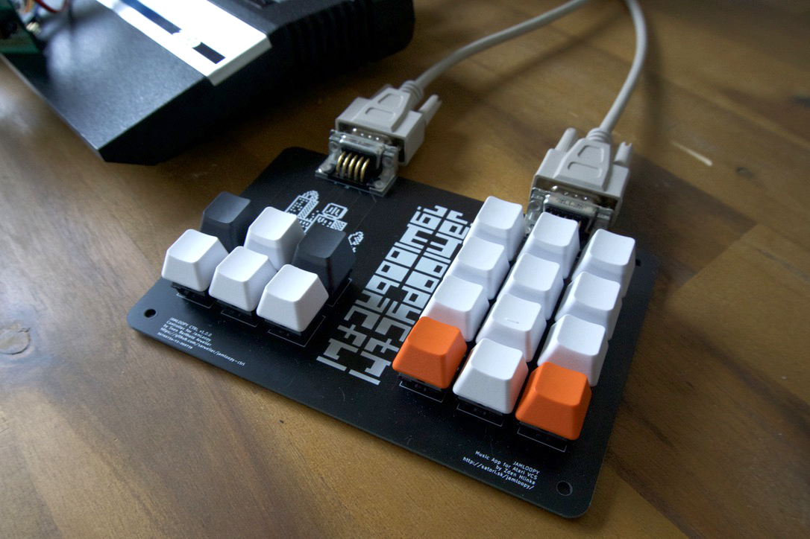

# JamLoopy Ctrl

JamLoopy Ctrl is a controller for the Atari 2600 music app [JamLoopy](http://satori.sk/jamloopy/) by Zden Hlinka. It's basically an Atari joystick circuit and an Atari keyboard controller circuit on a single PCB.

## Building JamLoopy Ctrl

Building a JamLoopy Ctrl is a very easy and beginner-friendly soldering project.

### PCB

Download the [jamloopy-ctrl-gerbers.zip](https://github.com/sarweiler/jamloopy-ctrl/releases/latest/download/jamloopy-ctrl-gerbers.zip) file for the latest release, upload the zip archive to a PCB manufacturer of your choice, and order a PCB. Usually the default settings for the PCBs are okay – just choose a color for the solder mask that you like, if you dont want the standard PCB-green.

### Parts

* Two 4.7kOhm resistors.
* 18 Cherry MX switches of your choice, preferably of the PCB-mount variant (with fixation pins, [these, for example](https://www.mouser.com/ProductDetail/540-MX1A-11NW)). Non-PCB-mount switches (frame mount, without fixation pins) will work, too, but you will have to be careful to align them correctly when soldering.
* Two female DB9 connectors of the PCB-mount variant with mounting pins ([these](https://www.mouser.com/ProductDetail/571-2311765-1), [these](https://www.reichelt.de/d-sub-buchse-9-polig-gewinkelt-rm-9-4-gedr-d-sub-bu-09gwc-p113921.html), or any connector with similar measurements will work).
* 18 Cherry MX compatible keycaps of your choice. (I used [these](https://www.aliexpress.com/item/32987364794.html?spm=a2g0s.9042311.0.0.27424c4dBs286T) in the "blank" variant.)
* Two DB9 extension cables for connecting the controller to the Atari.
* Optional: 4 rubber feet

### Soldering

* Start by soldering the two resistors (R1, R2).
* Solder the two female DB9 connectors (J1, J2).
* Solder all 18 Cherry MX switches. If you're using non-PCB-mount switches be careful to align them correctly.
* Install your keycaps on the switches.
* Add some rubber feet to the bottom of the PCB, if you like.
* Done!

## Using JamLoopy Ctrl

Using the controller is pretty straight forward: Connect the left port of your controller to the left joystick port on the Atari and the right port to the right joystick port on the Atari using two DB9 extension cables.

On the left side of the controller you've got a joystick in the form of cursor keys (UP1, DOWN1, LEFT1, and RIGHT1 on the PCB) and two fire buttons (FIRE1 and FIRE2 on the PCB). The fire buttons are identical, I just added a second one for symmetry reasons.

On the right side of the controller you've got an Atari keyboard controller with switches 1 to 9 and 0 (SW1 to SW9 and SW11), the \*-key (SW10) and the #-key (SW12).

For information on how to use JamLoopy, check out the [JamLoopy](http://satori.sk/jamloopy/) manual.

